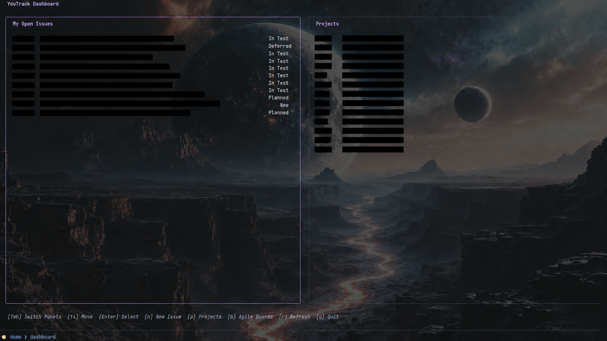
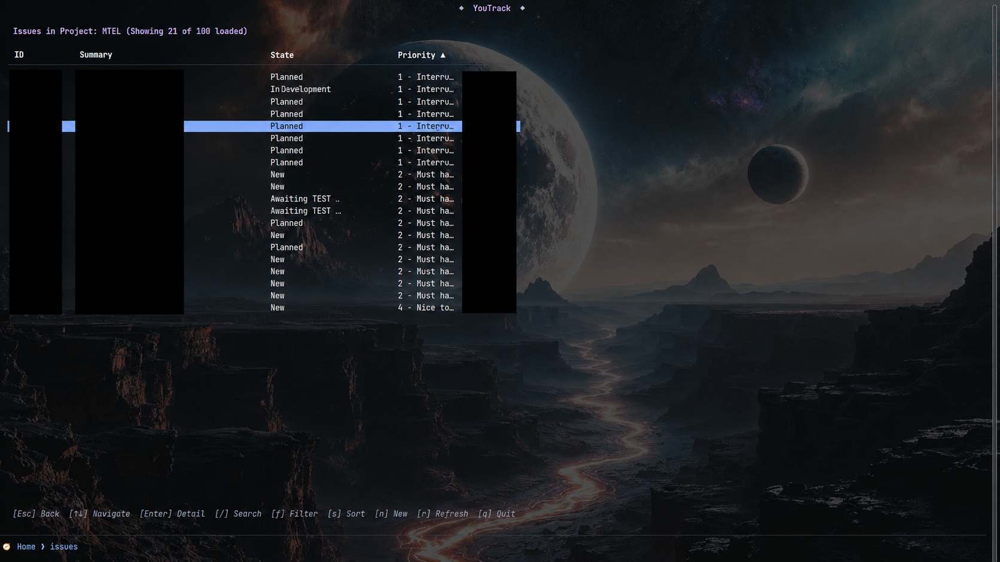
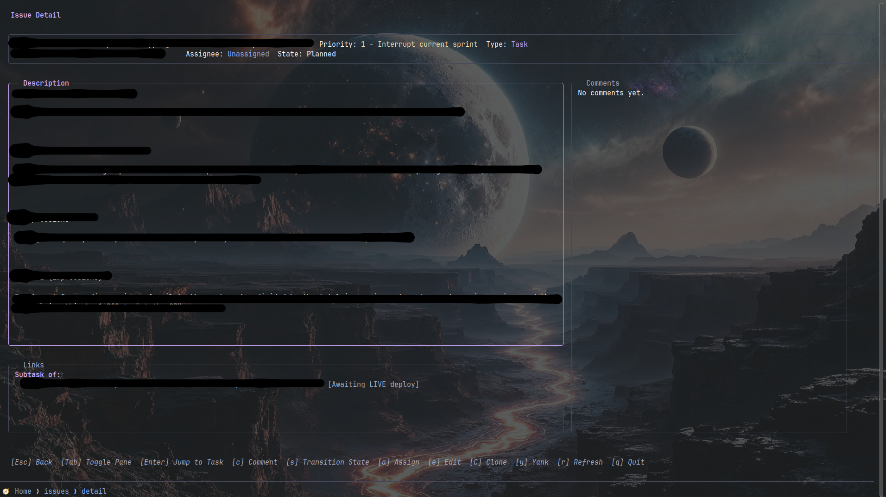
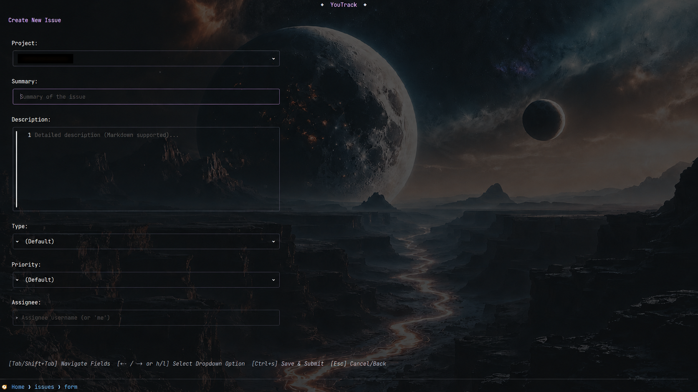
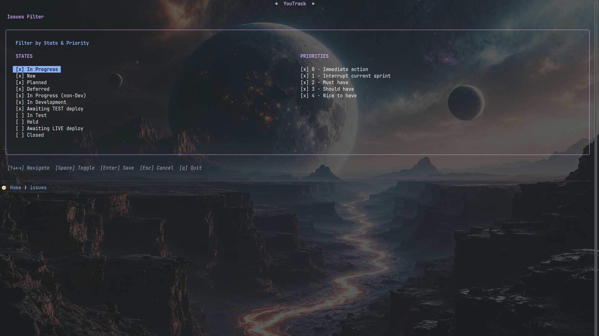
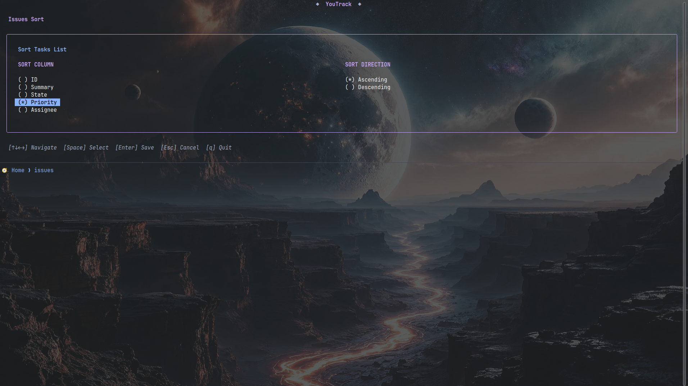

# 🎛️ YouTrack Terminal User Interface (TUI)

A sleek, keyboard-driven terminal dashboard for JetBrains YouTrack, written in Go using the **Bubble Tea** framework. It communicates directly with the YouTrack REST API to provide high-performance, asynchronous, and interactive issue management without requiring any external Python CLI.

Styled out-of-the-box with a vibrant **Catppuccin Mocha** color palette, `yt-tui` keeps you in your terminal flow while tracking your project tasks.

<p float="left">
  
  
</p>
<p float="left">
  
  
</p>
<p float="left">
  
  
</p>

---

## ✨ Features

- **🎛️ Interactive Dashboard (Home)**: A split-pane interface showing **My Open Issues** (unresolved issues assigned to you) alongside your **Projects**. Seamlessly toggle focus with `Tab`.
- **📂 Global Project Browser**: View and browse all accessible YouTrack projects in a clean tabular view.
- **⚡ Asynchronous Paginated Loading**: Loads issues in the background without blocking the UI, giving you an instantly responsive view even on large codebases.
- **🔍 Filter & Search**: Instantly query and filter issues in lists by readable ID or summary text using local filtering.
- **📝 Comprehensive Issue Detail**: Renders descriptions (with a toggle `m` to switch between plain text and formatted markdown, saved in configuration), assignees, priorities, states, and custom fields. Supports dedicated scrollable viewports for description, comments, linked issues, and attachments.
- **🔄 Complete Issue Lifecycle**:
  - **Create & Clone**: Instantly spawn new issues or clone existing ones (pre-populating description, type, priority, and assignee details).
  - **State Transitions**: Transition states (e.g. `Open` ➔ `In Progress` ➔ `Fixed`) dynamically.
  - **Assigning**: Quickly assign tickets to other team members, self-assign with `me`, or unassign with `unassigned` (also supports `unassign`, `none`, or `-`).
  - **Commenting**: Write and submit markdown comments directly from the detail view.
  - **Linked Issues**: Displays grouped relations (e.g., parent/subtask, depends on, etc.) with quick jump navigation on `Enter`.
  - **Task Attachments**: Lists issue files and attachments with their sizes; download and open them directly via `xdg-open` on `Enter`.
- **🛡️ Native REST API Integration**: Directly interacts with YouTrack REST API endpoints, completely avoiding Python keyring lockouts, credential corruption, or subprocess TTY issues.

---

## 🚀 Prerequisites

If you choose to build the project from source, you will need:
1. **Go Compiler**: Go 1.18+ installed on your system.

---

## 🛠️ Installation & Building

### 📦 Option 1: Download Pre-built Binaries (Recommended)

You can download the latest pre-compiled binary for your platform directly from the [GitHub Releases](https://github.com/nospor/yt-tui/releases) page.

1. Go to [Releases](https://github.com/nospor/yt-tui/releases) and download the archive matching your operating system and architecture (Linux, macOS, Windows; AMD64/ARM64).
2. Extract the downloaded archive.
3. (Optional) Copy the `yt-tui` binary to a directory in your `PATH` (e.g., `/usr/local/bin/` on Linux/macOS) to run it from anywhere.

### 🛠️ Option 2: Build from Source

If you have Go installed, you can build the application manually:

```bash
git clone https://github.com/nospor/yt-tui.git
cd yt-tui

# to quickly build
go build -o yt-tui .

# or (builds slower, but binary is smaller)
go build -trimpath -ldflags="-s -w" -o yt-tui .

# then run
./yt-tui

# you may also want to copy the binary to your PATH (and run it from any place), e.g.:
sudo cp yt-tui /usr/local/bin/
```

---

## 🏃 Usage

You can launch `yt-tui` without any parameters to open the welcome screen or the dashboard:

```bash
yt-tui
```

### Direct Issue Link Loading
You can also launch `yt-tui` directly with a YouTrack issue URL as an argument:

```bash
yt-tui https://youtrack.example.com/issue/PROJ-123
```

When you pass a URL:
1. `yt-tui` parses the URL to extract the base YouTrack server and the issue ID (e.g., `PROJ-123`).
2. It searches your configured servers in `config.json` (either the `url` field or the `servers` list).
3. If it finds a matching server, it automatically connects to that server and opens the issue detail view directly.
4. If no configured server matches the URL, it will display the welcome/login screen with the YouTrack Base URL pre-filled so you can enter your API token.

---

## ⚙️ Configuration

`yt-tui` loads its user settings and credentials from a JSON file located at `~/.config/yt-tui/config.json`. The file and its parent directories are automatically created with default settings on the first run.

### Environment Variables & `.env` Files (Optional)
You can resolve values in `config.json` dynamically from environment variables by prefixing the value with `$`. For example:

```json
{
  "url": "youtrack url",
  "token": "$SOMETOKEN"
}
```

When `yt-tui` encounters a value starting with `$`, it resolves it using:
1. **System Environment Variables**: (e.g., `os.Getenv("SOMETOKEN")`).
2. **Local/Config `.env` Files**: It checks for the variable definition in a local `.env` file in the current working directory, falling back to `~/.config/yt-tui/.env`.

If you do not specify a `url` or `token` in `config.json` at all, `yt-tui` will check standard fallback variables: `YOUTRACK_BASE_URL` and `YOUTRACK_TOKEN`.

If you have legacy credentials configured in `~/.config/youtrack-cli/.env`, they will be automatically migrated to your `config.json` on the first launch.

### Multi-Server Support (Optional)

If you manage issues across multiple YouTrack instances, you can configure an array of servers in your `config.json`. When the `servers` array is set, the application will display a list of these instances on startup for you to choose from.

```json
{
  "servers": [
    {
      "name": "Work YouTrack",
      "url": "https://work.youtrack.cloud",
      "token": "$WORK_TOKEN"
    },
    {
      "name": "Personal YouTrack",
      "url": "https://personal.youtrack.cloud",
      "token": "perm:abc123yourtokenhere"
    }
  ]
}
```

If you select one of the configured servers, `yt-tui` will authenticate using those credentials. You can also select the `➕ Connect to another YouTrack...` option to manually input a new server's URL and token.

### Default Config Structure

```json
{
  "url": "",
  "token": "",
  "page_size": 20,
  "max_issues": 500,
  "fields": ["ID", "Summary", "State", "Priority", "Assignee"],
  "custom_types": {
    "default": ["Bug", "Task", "Ops", "Initiative", "Epic"],
    "MTEL": ["Bug", "Feature", "Task"]
  },
  "custom_priorities": {
    "default": ["0 - Immediate action", "1 - Interrupt current sprint", "2 - Must have", "3 - Should have", "4 - Nice to have"],
    "MTEL": ["Minor", "Normal", "Major"]
  },
  "custom_states": {
    "default": ["Open", "In Progress", "Verified", "Done", "Duplicate", "Won't fix", "Incomplete"],
    "MTEL": ["In Development", "Testing", "Closed"]
  },
  "sort_column": "ID",
  "sort_direction": "asc",
  "favorite_view": "",
  "render_markdown": true,
  "image_viewer": "sxiv",
  "browser_command": "xdg-open",
  "gitlab_command": "",
  "theme": "catppuccin"
}
```

### Configuration Options

| Option                | Type             | Default                                                                          | Description                                                                                                                                                                                 |
| --------------------- | ---------------- | -------------------------------------------------------------------------------- | ------------------------------------------------------------------------------------------------------------------------------------------------------------------------------------------- |
| `url`                 | String           | `""`                                                                             | The base URL of your YouTrack instance (e.g. `https://company.youtrack.cloud`).                                                                                                             |
| `token`               | String           | `""`                                                                             | Your permanent YouTrack API token.                                                                                                                                                          |
| `servers`             | Array of Objects | `[]` (empty)                                                                     | List of YouTrack server configurations (each containing `name`, `url`, `token`, and optionally `vcs_base_url`) to choose from on startup.                                                  |
| `page_size`           | Integer          | `20`                                                                             | The number of issues requested per query page. Larger page sizes fetch more records at once, while smaller sizes load background pages in quicker increments.                               |
| `max_issues`          | Integer          | `500`                                                                            | The maximum number of issues to load for a project list. Once this limit is reached, the app will stop fetching new pages of issues to prevent performance degradation on massive projects. |
| `fields`              | Array of Strings | `["ID", "Summary", "State", "Priority", "Assignee"]`                             | The list of columns/fields to display on the tasks list. Supports standard fields (`ID`, `Summary`, `State`, `Priority`, `Assignee`, `Type`, `Updated`, `Updater`, `Created`, `Creator`/`Reporter`) as well as custom field names.                 |
| `custom_types`        | Object           | `{}` (empty)                                                                     | Custom list of issue type options configured per project (keyed by project ShortName or ID, e.g. `{"MTEL": ["Bug", "Task"], "default": ["Bug", "Feature"]}`) to populate the creation dropdown. Supports legacy array format as a fallback.                                                        |
| `custom_priorities`   | Object           | `{}` (empty)                                                                     | Custom list of issue priority options configured per project (keyed by project ShortName or ID, e.g. `{"MTEL": ["Minor", "Normal"], "default": ["Minor", "Major"]}`) to populate the creation dropdown. Supports legacy array format as a fallback. |
| `custom_states`       | Object           | `{}` (empty)                                                                     | Custom list of issue state transition options configured per project (keyed by project ShortName or ID, e.g. `{"MTEL": ["New", "In Dev"], "default": ["Open", "Closed"]}`) to populate the state selection modal. Supports legacy array format as a fallback. |
| `filtered_states`     | Array of Strings | `[]` (empty)                                                                     | List of selected issue states to display on the tasks list. States not in this list will be filtered out.                                                                                   |
| `filtered_priorities` | Array of Strings | `[]` (empty)                                                                     | List of selected issue priorities to display on the tasks list. Priorities not in this list will be filtered out.                                                                           |
| `sort_column`         | String           | `""`                                                                             | The column by which the tasks list is sorted (e.g. `ID`, `Summary`, `State`, etc.).                                                                                                         |
| `sort_direction`      | String           | `""`                                                                             | The sorting direction (`asc` or `desc`).                                                                                                                                                    |
| `favorite_view`       | String           | `""`                                                                             | The serialized view data parameter for the user's favorited tasks list (automatically updated when toggled via keyboard).                                                                   |
| `favorite_views`      | Object           | `{}` (empty)                                                                     | A map of server/connection URLs to their respective favorite views (automatically updated when toggled via keyboard).                                                                       |
| `work_types`          | Array of Strings | `["Development", "Documentation", "Implementation", "Investigation", "Testing"]` | Custom list of work types for time tracking dropdown selection instead of the standard default list.                                                                                        |
| `render_markdown`     | Boolean          | `true`                                                                           | Whether to format and render issue descriptions as markdown. Can be toggled inside the issue detail view by pressing `m`.                                                                   |
| `repo_options`        | Object           | `{}` (empty)                                                                     | Custom list of repository options per project (keyed by project ShortName or ID, e.g. `{"MTEL": ["repo1", "repo2"]}`) for updating the custom `Repo` field. Used as a fallback if options cannot be retrieved from YouTrack directly. |
| `filepicker_sort_by`  | String           | `""`                                                                             | The criteria by which files in the file picker are sorted (`Name` or `Datetime`).                                                                                           |
| `filepicker_sort_order`| String          | `""`                                                                             | The sorting direction of the file picker (`asc` or `desc`).                                                                                                                                 |
| `filepicker_last_dir` | String           | `""`                                                                             | The last directory visited by the file picker.                                                                                                                                             |
| `actions`             | Array of Objects | `[]` (empty)                                                                     | Custom templated action sequences triggered by `Space`. See [Custom Quick Actions](#-custom-quick-actions) below.                                                                             |
| `image_viewer`        | String           | `""` (empty)                                                                     | The command or executable to open image attachments (e.g. `sxiv` or `feh`). If empty or not an image file, it defaults to `xdg-open`.                                                        |
| `vcs_base_url`        | String           | `""` (empty)                                                                     | Base URL of your VCS (e.g. GitLab/GitHub instance) to resolve references like `group/project!mr` to links. Can also be set per-server in the `servers` list.                                |
| `browser_command`     | String           | `"xdg-open"`                                                                     | The command or executable used to open web browser links (e.g. `google-chrome`).                                                                                                            |
| `gitlab_command`      | String           | `""` (empty)                                                                     | The command or executable to open GitLab merge requests inside a popup TUI process (e.g. [gitlab-tui](https://github.com/nospor/gitlab-tui)). If empty, GitLab links are opened in the default browser. |
| `theme`               | String           | `"catppuccin"`                                                                   | The TUI color theme. Supported values: `catppuccin` (Catppuccin Mocha, default) and `teams` (adapted from `teams-tui-go` with green borders, cyan accents, and popups).                     |


### ⚡ Custom Quick Actions

You can configure custom templates to quickly update issues with predefined command sequences. Pressing `Space` inside either the **Issues List** (on the selected issue) or **Issue Detail** view will open a popup listing these actions. You can navigate the list with arrow keys and hit `Enter` to apply, or directly hit the shortcut key (e.g. `1`-`9`) to apply the template instantly.

Each action template is configured under the `actions` array in `config.json`. Below is an example structure:

```json
  "actions": [
    {
      "name": "In progress",
      "shortcut": "1",
      "commands": [
        {
          "type": "update_field",
          "field": "State",
          "value": "In Progress"
        }
      ]
    },
    {
      "name": "Assign to me & Add Comment",
      "shortcut": "2",
      "commands": [
        {
          "type": "assign",
          "value": "me"
        },
        {
          "type": "comment",
          "value": "Starting work on this task."
        }
      ]
    }
  ]
```

Supported action command types:
- `update_field`: Updates any single-value custom field (e.g., `State`, `Repo`, `Priority`). Requires `field` and `value`.
- `comment`: Adds a comment to the issue. Requires `value` containing the comment text.
- `assign`: Assigns the issue to a user (use `"me"`, `"unassigned"`, or any valid username). Requires `value`.

---

## ⌨️ Keyboard Controls & Navigation

### 🌐 Global Controls
* `Ctrl+C`: Force quit the application at any time.
* `?`: Toggle the help popup from any screen (except when welcome screen is shown or a text input/textarea is active), showing all keyboard shortcuts split by views.
* `S`: Open the global search popup from any screen (except when a text input or textarea is active).
  - Type or paste a phrase in the input field, then press `Enter` to search.
  - **Note**: YouTrack matches full words/phrases 
  - Once search completes, use `↑` / `↓` (or `k` / `j`, `Ctrl+P` / `Ctrl+N`) to navigate the results.
  - Press `Enter` to open the details view for the selected task.
  - Press `s` or `S` while navigating the list to focus back on the input field to search again.
  - Press `Esc` to close the popup.

### 🚪 Welcome / Login View
* **Server Selection Mode** (when `servers` is configured):
  - `↑` / `↓` (or `k` / `j`): Navigate the server list.
  - `Enter`: Select and authenticate with the chosen YouTrack instance.
  - `q` / `Ctrl+C`: Force quit the application.
* **Credentials Entry Mode**:
  - `Tab` / `Shift+Tab`: Switch focus between YouTrack Base URL and API Token fields.
  - `Enter`: Save credentials and authenticate.
  - `Esc`: Return to Server Selection Mode (if `servers` array is set).
  - `Ctrl+C`: Force quit the application.

### 🏠 Dashboard View (Home Screen)
* `Tab` / `Shift+Tab`: Switch active focus panel (**My Open Issues** vs **Projects**).
* `↑` / `↓` (or `k` / `j`): Scroll items inside the active focus panel.
* `Space` (when focusing My Open Issues): Open the custom quick Actions popup to quickly update the selected issue using a templated sequence (either select via list or hit shortcut number).
* `Enter`: Open the highlighted item:
  - Selecting an issue opens the **Issue Detail** view.
  - Selecting a project opens the **Issues List** filtered to that project (selecting **Issues created by me** displays all issues created/reported by you).
* `n`: Create a new issue (pre-selects the highlighted project if focused).
* `p`: View the full **Projects List** screen.
* `b`: View the full **Agile Boards** screen.
* `f`: Jump directly to your configured favorite tasks list (shows an error message if none is set yet).
* `r`: Reload and refresh all dashboard data.
* `q`: Exit application.

### 📂 Projects List View
* `↑` / `↓` (or `k` / `j`): Navigate projects table.
* `Enter`: View issues inside the selected project.
* `n`: Create a new issue in the selected project.
* `r`: Refresh projects list.
* `Esc` / `Backspace`: Go back to the dashboard.
* **Note**: A special project called **Issues created by me** is pinned at the top of the list (separated from real projects by a blank line). Entering this project displays all issues created/reported by you (`reporter: me`).

### 🎛️ Agile Boards View
* `↑` / `↓` (or `k` / `j`): Navigate agile boards table.
* `Enter`: View issues belonging to the selected board.
* `r`: Refresh agile boards list.
* `Esc` / `Backspace`: Go back to the dashboard.

### 📋 Issues List View
* `↑` / `↓` (or `k` / `j`): Scroll issues table.
* `Enter`: View details of the selected issue.
* `/`: Activate search/filter mode. Type keywords to filter issues by summary/ID. Press `Esc` or `Enter` to close search mode.
* `Space`: Open the custom quick Actions popup to quickly update the selected issue using a templated sequence (either select via list or hit shortcut number).
* `f`: Toggle the current tasks list view as your favorite view (adds/removes a yellow star `★` in the header and saves to config).
* `F`: Open the State & Priority filter panel. Use arrow keys/hjkl to navigate, Space to toggle checkboxes, Enter to save, and Esc to cancel.
* `s`: Open the Column & Direction sort panel. Use arrow keys/hjkl to navigate, Space to select choices, Enter to save, and Esc to cancel.
* `n`: Create a new issue in the current project context.
* `r`: Clear cache and force reload issues list.
* `Esc` / `Backspace`: Go back to the dashboard/previous screen.

### 🔍 Issue Detail View
* `Tab` / `Shift+Tab`: Cycle focus forwards/backwards between the Description, Comments, Links (Parents/Children), and Attachments viewports.
* `↑` / `↓` (or `k` / `j`): Scroll/navigate within the active viewport. In the Comments, Links, and Attachments viewports, this moves the selection cursor.
* `Enter` (in Links viewport): Jump directly to the highlighted parent/child task.
* `Enter` (in Attachments viewport): Download the highlighted attachment and open it with `xdg-open`.
* `d` (in Links viewport): Delete the highlighted link (with confirmation).
* `d` (in Attachments viewport): Delete the highlighted attachment (with confirmation).
* `Ctrl+f`: Open the file browser popup to pick and attach files from your computer to the issue immediately.
* `Ctrl+g`: View the description (when focusing the Description viewport) or the currently selected comment (when focusing the Comments viewport) in your preferred external editor without saving changes.
* `Space`: Open the custom quick Actions popup to quickly update the issue using a templated sequence (either select via list or hit shortcut number).
* `c`: Add a comment. Type your comment and press `Enter` to submit, `Alt+Enter` to insert a newline (multiline), or `Esc` to cancel. You can also press `Ctrl+v` to paste and upload an image from the system clipboard, `Ctrl+f` to open the file browser popup to pick and attach files from your computer, or `Ctrl+g` to write/edit the comment in your preferred external editor.
* `s`: Transition issue state (opens state input prompt; e.g. type `In Progress` or `Fixed` and hit `Enter`).
* `R`: Select and update the custom `Repo` field options (opens selection menu; Left/Right to choose, Enter to save, Esc to cancel).
* `a`: Assign issue (opens assignee input prompt; type username, `me`, or `unassigned` to unassign, and hit `Enter`).
* `e`: Edit/update this issue's details (Summary, Description, Priority, Type, Assignee). When focusing the Comments viewport and a comment is selected, this edits the selected comment instead (supporting `Alt+Enter` for newlines, `Ctrl+v` image paste, `Ctrl+f` computer file attachment, and `Ctrl+g` external editor inside the comment editor).
* `C`: Clone this issue. Pre-populates the new issue form with this ticket's details, and automatically links the new issue back to the original under the "Is clone of" relationship.
* `y`: Start a yanking motion to copy issue details to the clipboard. Follow with:
  - `i`: Copy just the task ID to the clipboard.
  - `s`: Copy the task ID and summary (one line, separated by space) to the clipboard.
  - `d`: Copy the task description to the clipboard.
  - `u`: Copy issue URLs (extracts URLs from description, the YouTrack issue URL itself, linked issues, and attachment download URLs; copies if only 1 is found, or shows a selection popup if multiple exist).
  - `c`: Copy the currently selected comment to the clipboard (only visible/available when focusing the Comments viewport and a comment is selected).
  - Pressing any other key cancels the yanking motion.
* `o`: Show a list of unique URLs found in the description, comments, links, and attachments. Highlight and select a URL to open it. It will open via `browser_command` (defaults to `xdg-open`). If the URL is a GitLab merge request and `gitlab_command` is configured (e.g. to `gitlab-tui`), it opens the URL using that command in an interactive popup instead. You can find the GitLab TUI repository at [gitlab-tui](https://github.com/nospor/gitlab-tui).
* `m`: Toggle formatting the issue description between plain text and markdown (choice is remembered in configuration).
* `t`: Track time (opens a popup with an interactive calendar to select a date, duration input in `1w 1d 1h 1m` format, work type selection, and comment textarea).
* `F` (in Comments viewport): Open the Activity filter panel (Comments, Spent Time, VCS Changes, Change History). Use arrow keys/hjkl to navigate, Space to toggle checkboxes, Enter to save, and Esc to cancel.
* `r`: Force refresh issue details, comments, links, and attachments.
* `Esc` / `Backspace`: Go back to the issues list (or the previous issue if navigated via links).

### 📝 Issue Form (Create / Clone / Edit)
* `Tab` / `Shift+Tab` / `↑` / `↓`: Move focus between form fields (Project, Summary, Description, Type, Priority, Assignee).
* `←` / `→` (or `h` / `l`): Cycle options in dropdown fields (Project, Type, Priority).
* `a`-`z` (on dropdown fields): Pressing the first letter of an option jumps directly to that choice.
* `Ctrl+g` (on Description field): Open preferred external editor (using the `$EDITOR` environment variable) to write/edit the description.
* `Ctrl+v` (on Description field): Paste an image directly from the system clipboard (Linux `xclip`/`wl-paste`, macOS, Windows). This injects standard Markdown image syntax and uploads the image to YouTrack on form submission.
* `Ctrl+f` (on Description field): Open the file browser popup to pick and attach files from your computer. Supports sorting results by name/datetime (pressing `s`) and order asc/desc (pressing `o`). Last directory and sorting options are persisted in your config file.
* `Ctrl+s` (or `Enter` on text inputs): Submit the form and save/create/clone the issue.
* `Esc`: Cancel and discard changes.

## License

TeamsTUI is licensed under the MIT License. See [LICENSE](LICENSE) for details.

## Thanks For Visiting
Hope you liked it. Wanna **[buy Me a coffee](https://www.buymeacoffee.com/nospor)**?

